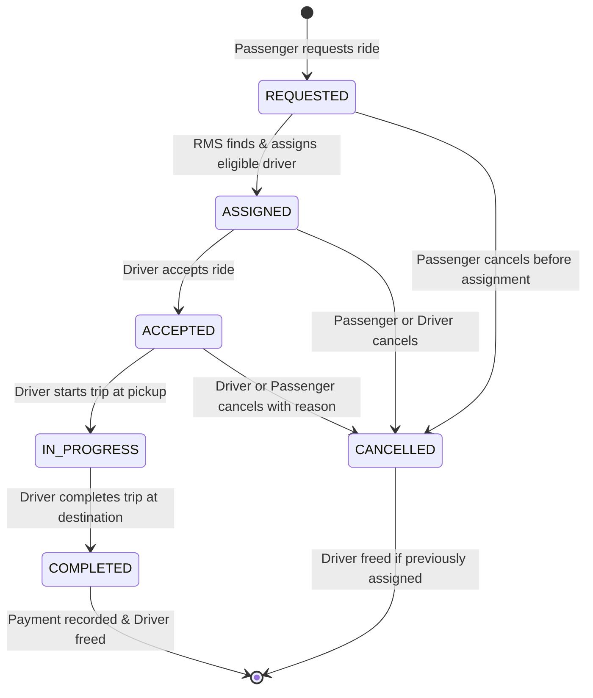
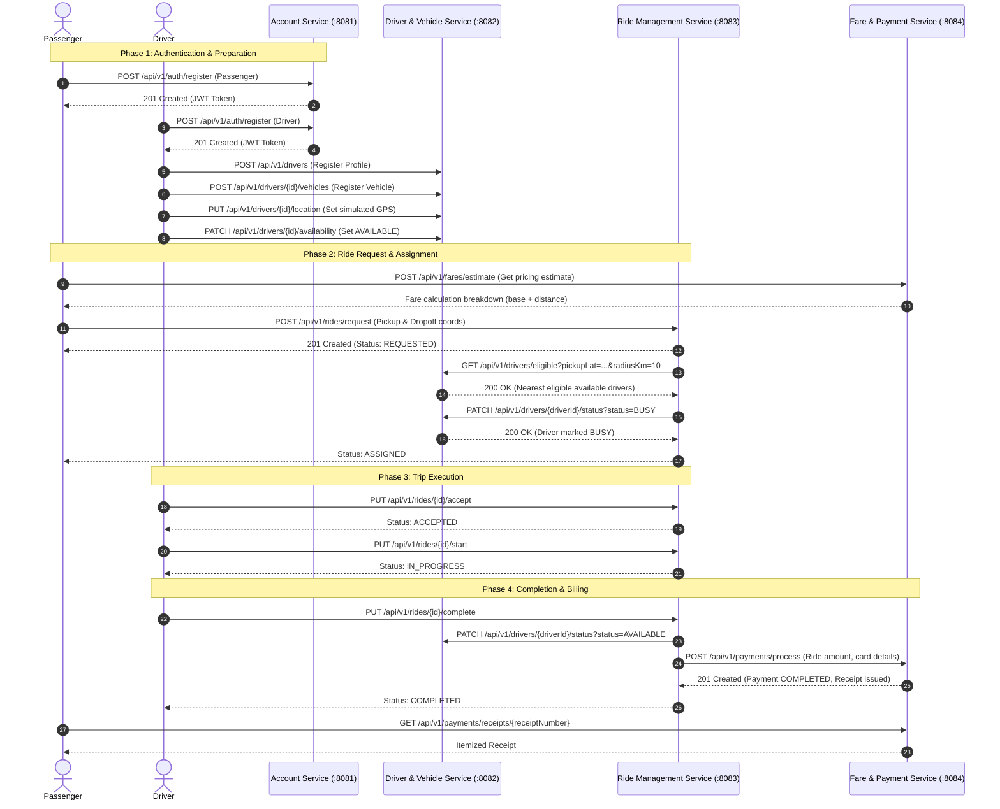

# RideLink Architecture & Technical Design Document

This document provides architectural reasoning, service boundary definitions, interservice communication rationale, and data ownership models for the RideLink backend platform, fulfilling requirements for **LO1, LO2, LO3, and Rubrics G1, G2, G3**.

---

## 1. System Overview & Service Decomposition

RideLink is decomposed into **four independent microservices**, each with its own bounded context and database:

```mermaid
graph TD
    Client["Swagger UI / Postman Client"]

    subgraph Service Layer
        AS["Account Service (:8081)<br/>Member 1"]
        DVS["Driver & Vehicle Service (:8082)<br/>Member 2 (My Service)"]
        RMS["Ride Management Service (:8083)<br/>Member 3"]
        FPS["Fare & Payment Service (:8084)<br/>Member 4"]
    end

    subgraph Database Boundary [Independent MongoDB Atlas Databases]
        DB1[("ridelink_account_db")]
        DB2[("ridelink_driver_db")]
        DB3[("ridelink_ride_db")]
        DB4[("ridelink_fare_db")]
    end

    Client -->|Auth & Profile| AS
    Client -->|Driver & Vehicle Ops| DVS
    Client -->|Ride Lifecycle| RMS
    Client -->|Fare & Payments| FPS

    AS --> DB1
    DVS --> DB2
    RMS --> DB3
    FPS --> DB4

    RMS -->|1. GET /api/v1/drivers/eligible| DVS
    RMS -->|2. PATCH /api/v1/drivers/{id}/status| DVS
    RMS -->|3. POST /api/v1/payments/process| FPS
```

### Microservice Ownership Matrix

| # | Microservice | Port | Owner | Database | Key Responsibilities |
|---|---|---|---|---|---|
| 1 | **Account Service** | `8081` | Member 1 | `ridelink_account_db` | User registration, authentication, JWT token issuance, RBAC, profile updates. |
| 2 | **Driver & Vehicle Service** | `8082` | Member 2 *(My Part)* | `ridelink_driver_db` | Operational profile, vehicle registration, active vehicle, real-time GPS location, availability, eligible driver search. |
| 3 | **Ride Management Service** | `8083` | Member 3 | `ridelink_ride_db` | Ride request creation, driver assignment, ride lifecycle state machine, trips tracking. |
| 4 | **Fare & Payment Service** | `8084` | Member 4 | `ridelink_fare_db` | Documented fare calculation, fare estimates, simulated payment execution, receipt issuance. |

---

## 2. Data Ownership & Isolation Boundary

In accordance with strict microservice design principles:
- **No Shared Databases**: Each service connects strictly to its own dedicated MongoDB database (`ridelink_account_db`, `ridelink_driver_db`, `ridelink_ride_db`, `ridelink_fare_db`).
- **Data Encapsulation**: A service never accesses another service's collections directly. All cross-domain operations occur via versioned REST APIs.
- **Stable Identifiers**: Cross-service references use string IDs (e.g., `userId`, `driverId`, `vehicleId`, `rideId`).

---

## 3. Interservice Communication: Selection & Justification (LO2 / Rubric G3)

### Comparison of Approaches

| Criteria | Synchronous REST (Selected) | gRPC (Alternative) | Message Queue / AMQP (Alternative) |
|---|---|---|---|
| **Protocol** | HTTP/1.1 or HTTP/2, JSON | HTTP/2, Protocol Buffers | RabbitMQ / Kafka, Asynchronous Events |
| **Complexity** | Low - standard Spring `RestTemplate` / `RestClient` | High - requires `.proto` compilation and binary toolchains | Medium to High - requires broker setup (Erlang/Zookeeper) |
| **Coupling** | Moderate runtime coupling | Moderate runtime coupling | Loose temporal coupling |
| **Best Used For** | Immediate request-response workflows (e.g. driver matching) | High-throughput internal microservices | Event notifications, logging, eventual consistency |
| **Suitability for RideLink** | **Optimal**: Drivers must be confirmed immediately before a ride is locked. | Overkill for 4 core business services in this scope. | Excellent for billing receipts, but adds setup overhead for assignment. |

### Implemented Interactions
1. **Ride Matching (`RMS` -> `DVS`)**:
   - `RMS` calls `GET /api/v1/drivers/eligible?pickupLat=...&pickupLng=...&radiusKm=10`.
   - `DVS` uses the **Haversine great-circle formula** to compute distances in kilometers, filters drivers where `availability == AVAILABLE` and `verification == VERIFIED`, sorts by closest proximity, and returns candidates.
   - `RMS` assigns the closest driver and immediately executes `PATCH /api/v1/drivers/{driverId}/status?status=BUSY` to prevent race conditions.
2. **Ride Completion & Billing (`RMS` -> `DVS` & `RMS` -> `FPS`)**:
   - When the trip completes, `RMS` releases the driver via `PATCH /api/v1/drivers/{driverId}/status?status=AVAILABLE`.
   - `RMS` sends `POST /api/v1/payments/process` to `FPS` to record simulated billing and generate an itemized receipt.

---

## 4. Ride Lifecycle State Machine

RideLink enforces strict finite state machine validation:



### Invalid Transitions Handled:
- Attempting to complete a ride that is not `IN_PROGRESS` returns `400 Bad Request`.
- Attempting to start a ride before it is `ACCEPTED` returns `400 Bad Request`.
- Attempting to cancel an already `COMPLETED` ride returns `400 Bad Request`.

---

## 5. End-to-End Workflow Sequence Diagram



---

## 6. Microservices vs. Monolithic Architecture Comparison (LO1)

| Dimension | RideLink Microservices Architecture (Selected) | Monolithic Architecture (Alternative) |
|---|---|---|
| **Independent Deployability** | High. Each service can be built, updated, and deployed independently without affecting others. | Low. Any update requires recompiling and redeploying the entire monolithic WAR/JAR. |
| **Fault Isolation** | High. A failure in the Fare/Payment service does not bring down driver location updates or authentication. | Low. An OutOfMemoryError or unhandled exception can take down the whole platform. |
| **Technology Flexibility** | High. Each service could theoretically adopt different database engines or specialized frameworks. | Low. Locked into a single runtime stack and database technology across all features. |
| **Data Boundary** | Strict. Each domain owns its MongoDB database, preventing tight coupling and schema bleed. | Loose. Multiple domains often run complex joins across tables, resulting in monolithic lock-in. |
| **Operational Complexity** | Higher. Requires managing 4 ports, network latency, distributed logging, and contract versioning. | Lower. Single executable, single database, in-memory method calls. |
